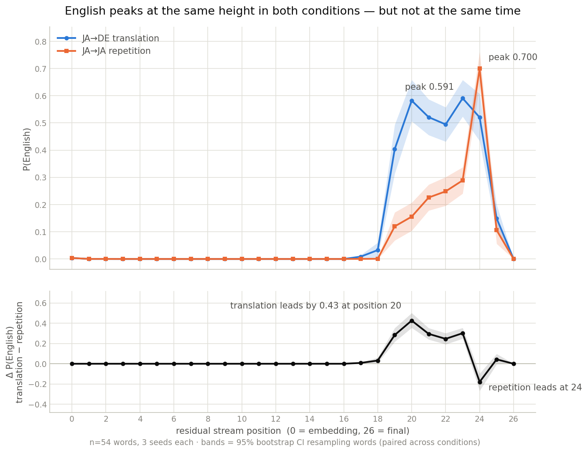
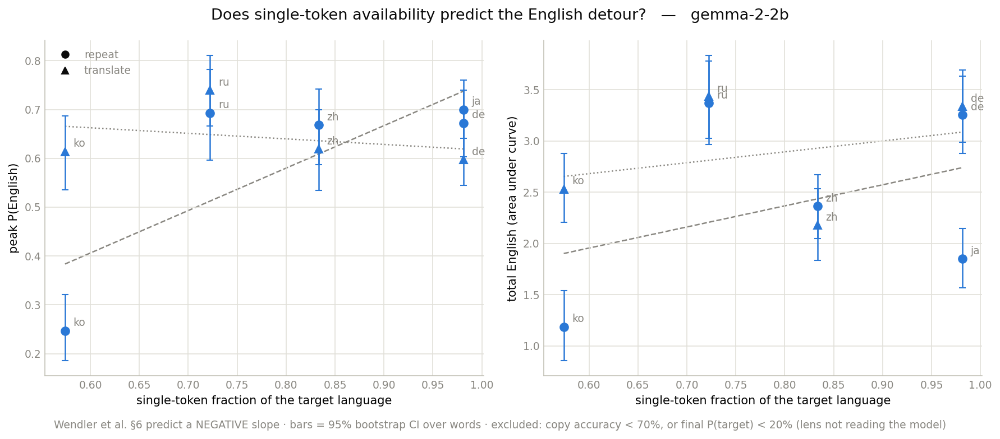

# Does Gemma Work in English?

A logit-lens replication testing whether **gemma-2-2b** routes through English when translating Japanese → German, measured against a Japanese → Japanese repetition control.

## Background and attribution

This replicates the probabilistic half of:

> Wendler, C., Veselovsky, V., Monea, G., & West, R. (2024). *Do Llamas Work in English? On the Latent Language of Multilingual Transformers.* ACL 2024, 15366–15394. [arXiv:2402.10588](https://arxiv.org/abs/2402.10588) · [epfl-dlab/llm-latent-language](https://github.com/epfl-dlab/llm-latent-language)

**Theirs:** the experimental design (few-shot translation and repetition tasks), the logit-lens reading of intermediate residual streams, the word-selection criteria, and the `Start(w)` prefix-summation scoring method (their Appendix A.2).

**Mine:** the port to gemma-2-2b (they use Llama-2 7B/13B/70B and Mistral-7B), the Japanese source language (they cover Chinese, German, French, Russian, Estonian), the German target pairing, and the scoring audit described below.

Wendler's conclusion is narrower than their title: the internal lingua franca is *not English but concepts — concepts biased toward English*. This replication inherits that framing.

## Result

All numbers below are at n=54 words × 3 demonstration seeds, with `Start(w)` prefix-summation scoring, and are reproducible from the committed arrays with `python analysis.py --check`.

**Peak height and total English disagree — and both differences are resolvable.**

| condition | peak P(EN) | ±95% CI | position |
|---|---|---|---|
| JA→DE translation | 0.5907 | 0.0672 | `23_pre` |
| JA→JA repetition | 0.6997 | 0.0619 | `24_pre` |

Δ peak (translation − repetition) = **−0.1090**, 95% paired bootstrap CI over words **[−0.1494, −0.0563]** — excludes zero. This is the confirmatory statistic, fixed before the sweep ran.

It says something counterintuitive: **repetition reaches a higher English peak than translation does.** Copying a Japanese word back produces more English at its maximum than translating it into German.

Summed across the forward pass, the ordering reverses. Total English probability over all 27 positions is **3.30** for translation against **1.85** for repetition — Δ = **+1.4583, CI [+1.2184, +1.7109]**, also excluding zero.

<p align="center">
  
</p>

| residual position | 19 | 20 | 21 | 22 | 23 | 24 |
|---|---|---|---|---|---|---|
| translation P(EN) | 0.404 | **0.582** | 0.521 | 0.495 | 0.591 | 0.520 |
| repetition P(EN) | 0.120 | 0.156 | 0.226 | 0.249 | 0.289 | **0.700** |
| Δ, paired | +0.284 | **+0.427** | +0.295 | +0.246 | +0.302 | −0.180 |
| 95% CI excludes 0 | ✓ | ✓ | ✓ | ✓ | ✓ | ✓ |

Translation holds English above 0.4 for six consecutive positions. Repetition climbs slowly, fires once at 24, and is gone by 25 — a spike immediately before Japanese resolves.

**So the two conditions differ in how they spend English, not in whether they use it.** Translation spreads it across the second half of the stack; repetition concentrates it into a single position, reaching higher there than translation ever does. A reader given only the peak would conclude repetition is the more English-mediated task. A reader given only the total would conclude the opposite. Both are backed by intervals that exclude zero, so this is not a power problem — it is a statistic-choice problem, and the choice has to be argued rather than defaulted to.

⚠️ The position-wise and area statistics are **exploratory** — chosen after seeing that the curves differed in shape, and 27 positions are tested without correction. The peak comparison is the pre-specified one and it now separates, so the confirmatory and exploratory results agree on *that* the conditions differ while disagreeing on direction. (Position 17 also has a CI excluding zero at Δ ≈ 0.008 — resolvable, substantively nothing. Eleven further positions clear zero at |Δ| < 1e-4, where both curves are flat and the interval is measuring bf16 rounding.)

**Read against Wendler, this is a replication with a sharper instrument.** They report (§6) that the English-first pattern persists in repetition but is *less pronounced*. Measured as peak height it is more pronounced here, not less. Measured as duration it is unmistakably less. Their qualitative claim survives only under the second reading, and the paper does not say which it means.

A second result does **not** fit their account at all. Wendler attribute the weak Chinese repetition effect to tokenization, Chinese being 100% single-token: with a one-token target available the model can commit to the source language immediately, and they report it rising simultaneously with or faster than English. Japanese here is 98% single-token — essentially the same profile — and does not do this. In repetition English reaches 0.700 at position 24 while Japanese is still at 0.089; Japanese only resolves at 25–26. English clearly *precedes* it. A language with Chinese-like tokenization does not show the Chinese pattern, which is evidence that single-token availability is not by itself what drives the effect. This held under the broken lens and holds under the corrected one. See [research-log.md](research-log.md) §7 and [tokenization_vs_detour.ipynb](tokenization_vs_detour.ipynb), which tests the conjecture directly rather than by cross-language analogy.

### What the logit-lens correction changed

The first run of this experiment used `cache.apply_ln_to_stack()`, which normalises every layer's residual by the *final* layer's cached scale — TransformerLens's **logit-attribution** convention. The logit lens requires each latent to be normalised by its own scale (Wendler §3.2, "treating it as if it were a final-layer latent"). Because residual norms grow with depth, intermediate latents were being divided by a scale much larger than their own and were systematically suppressed.

The two conventions agree exactly at the final row, which is the only row the verification checked. That is why it passed for the entire life of the bug.

| | broken lens | corrected | moved |
|---|---|---|---|
| peak P(EN), translation | 0.6170 | 0.5907 | −0.026 |
| peak P(EN), repetition | 0.6627 | 0.6997 | +0.037 |
| Δ peak | −0.0457 | −0.1090 | CI now excludes zero |
| Δ at position 20 | +0.3636 | +0.4266 | +0.063 |
| Δ area | +1.2000 | +1.4583 | +0.258 |
| peak positions | 23 / 24 | 23 / 24 | unchanged |
| final-row probabilities | — | — | **identical to the digit** |

The last two rows are the check that the fix did what it claimed and nothing else: the two normalisations are mathematically identical at the last layer, and the measured final row is unchanged (`[0, 0, 0.868]` translation, `[0.989, 0.000, 0]` repetition). Everything that moved is a mid-stack magnitude. The correction also changed the *conclusion* — under the broken lens the pre-specified test could not resolve a difference at all, and the entire finding rested on statistics chosen after the fact.

Unaffected throughout: behavioural accuracy, single-token fractions, `Start(w)` id sets, and everything in the scoring audit below.

### Scoring audit

The headline number depends on a detail buried in Wendler's appendix. P(language) is **not** the probability of one token; it is the sum over `Start(w)`, every vocabulary token that could begin the correct word — all token-level prefixes, with and without a leading space, plus byte-fallback tokens. An earlier version of this notebook scored a single first token per language and, for Japanese, scored the *unspaced* form while the prompt guarantees a space-prefixed answer. That made P(Japanese) read near zero at every layer *including the final one*, where Japanese is the correct answer. The asymmetry — German reaching 0.86 while Japanese flatlined — is what exposed it.

That fix has two parts, and **only the first was applied for most of this project's life.** The space correction landed; the prefix summation did not — `start_token_ids` returned two ids per word with no vocabulary scan, and an entire n=54 sweep was run that way. It was caught by reading the notebook source against the methods notes, not by any test, because no gate in the pipeline could see it: the lens assertion indexes the same ids on both sides, the behavioural check reads strings rather than ids, and the filter was comparing sets that happened to be singletons. The filter cell now **asserts** that id sets are wider than one token, so the same omission halts the run.

Applying it widened the id sets substantially — `Blume` 2 → 8 ids (gaining `' B'`, `' Bl'`, `' Blu'`, `' Blum'`), `flower` 2 → 10, and 花 2 → 2, since a single kanji has no shorter string prefix.

**It barely moved the results:** peak P(EN) went 0.6141 → 0.6170 for translation and 0.6626 → 0.6627 for repetition. (Both sides of that comparison predate the lens correction, so the absolute values are superseded by the table above — but the comparison is internally consistent, since the same lens produced both, and the *size* of the change is what is being reported.) That is worth reporting rather than hiding, and it is not a coincidence — with a word list that is 98–100% single-token, the canonical token already carries nearly all the mass and the fragmentary prefixes carry almost none. The magnitude of the prefix-summation correction is itself a function of single-token availability, which is precisely why Wendler need it for Russian (13%) and why it is nearly a no-op here.

## Does tokenization explain the detour?

Wendler et al. (§6) conjecture that the English detour is weaker where the target
language has single-token words: *"where language-specific tokens are available, the
detour through English seems less pronounced."* The prediction is **negative** — more
single-token words, less English. Their evidence is four languages with different
single-token fractions, which confounds tokenization with script, morphology, corpus
share, and competence.

[tokenization_vs_detour.ipynb](tokenization_vs_detour.ipynb) tests it directly on the
repetition task, where the claim actually lives. Same 54 concepts, same prompt
template, same scoring, five target languages on gemma-2-2b. Reproduce with
`python tokenization_analysis.py`.

| target | single-token frac | peak P(EN) | total English (AUC) | copy acc | final P(target) |
|---|---|---|---|---|---|
| German | 98% | 0.672 | 3.254 | 100% | 0.989 |
| Japanese | 98% | 0.700 | 1.849 | 100% | 0.989 |
| Chinese | 83% | 0.668 | 2.365 | 100% | 0.986 |
| Russian | 72% | 0.693 | 3.372 | 100% | 0.994 |
| Korean | 57% | 0.247 | 1.188 | 100% | 0.998 |

**The correlation runs the wrong way.** Spearman rho = **+0.616** on peak and
**+0.205** on area, across five languages on one model. Wendler predict negative;
both statistics come out positive. This held under the broken lens and strengthened
under the corrected one.

<p align="center">
  
</p>

**Korean is the clean counterexample.** It has the *worst* tokenization here (57%
single-token) and the *weakest* detour by a wide margin — peak 0.247 against 0.67–0.70
for every other language. The conjecture predicts the strongest. And this is not the
model failing the task: copy accuracy is 100% and final P(Korean) is 0.998, the
highest of the five. The lens is reading a model that is doing the task correctly and
simply not routing through English to do it.

**German and Japanese share a tokenization profile and behave differently.** Both 98%
single-token, near-identical peaks (0.672 vs 0.700) — but German carries **76% more**
total English across the stack. If single-token fraction were doing the work, these two
should be indistinguishable.

### The shared-character control

The cross-language comparison above still confounds tokenization with everything else
about a language. One subset does not: **17 of the 54 concepts are written with the
same character in Japanese and Chinese** (花, 山, 水, 王 …), so the target is *literally
the same token id*. Tokenization is held exactly constant — not approximately — and
only the language framing of the prompt changes.

| | peak P(EN) | total English |
|---|---|---|
| Japanese framing | 0.734 | 1.736 |
| Chinese framing | 0.684 | 2.015 |
| difference | **+0.050**, CI [−0.025, +0.136] | **−0.279**, CI [−0.526, −0.024] |

Paired bootstrap over the 17 concepts, resampling concepts and indexing both languages
with the same resample. The area difference excludes zero; the peak difference does not.

So the detour moves while tokenization is pinned. Whatever drives the difference between
Japanese and Chinese here, it is not how the answer is tokenized — because it is the
same token.

⚠️ **This is the strongest single result in the project and it is still suggestive, not
established.** n=17, two statistics tested with no correction, one of the two intervals
only just clears zero, and the whole thing rests on one model. It is stated at that
strength deliberately.

### What this does and does not license

It does **not** show Wendler are wrong. They measure Llama-2 and Mistral; this is
gemma-2-2b, five languages, one prompt template, concrete nouns only. A conjecture that
holds in their setting and not in this one is a scope finding, not a refutation.

What it does show is that the tokenization explanation is not general enough to survive a
model swap, and that the one comparison which isolates tokenization from language finds
the effect somewhere else. The **within-language, across-model** test — same words,
different tokenizer — would be the decisive version, and it has not produced a number
(see Limitations).

## Reproduction

**Environment** (versions the reported results were produced on):

| | |
|---|---|
| numpy | 2.0.2 |
| transformers | 4.57.6 |
| transformer_lens | 2.18.0 |
| hardware | Tesla T4 (Kaggle), CUDA |
| dtype | bfloat16 |

See [requirements.txt](requirements.txt). Two installation constraints, both load-bearing:

1. **Install `transformer_lens` with `--no-deps`.** It pins `numpy<2` and will otherwise downgrade numpy underneath an imported binary, causing a C-ABI import error.
2. **Restart the kernel after installing, before importing anything.** Pip replacing packages on disk does not change what is already loaded in memory.

**Running:** open [mechanistic_interpretability.ipynb](mechanistic_interpretability.ipynb) and run top to bottom. It needs a Hugging Face token with access to `google/gemma-2-2b` (prompted for, or set `HF_TOKEN`). Output location defaults to `/kaggle/working` and is overridable via `OUT_DIR`. The sweep is 54 words × 3 seeds × 2 conditions = 324 forward passes; wall-clock is dominated by the ~10 GB model download.

Analysis is deliberately separate from the sweep. The notebook produces arrays; [analysis.py](analysis.py) turns them into every number and figure reported here, with no GPU and a fixed bootstrap seed:

```
python extract_results.py     # decode the arrays out of the notebook's output
python analysis.py --check    # recompute everything, assert the reported values
```

`--check` asserts the published numbers and prints, alongside each, what the same statistic read under the broken lens. It exists to isolate one variable: if a re-run moves a number, the analysis did not move, so something upstream did. That is the gate the project spent three bugs learning to want.

Three sanity gates run before any result is produced, and all three should be checked:

- **Behavioural** — the model must actually do the task: 12/12 on translation, 12/12 on repetition.
- **Lens verification** — the hand-rolled lens must reproduce the model's own output distribution. Observed agreement to ~0.5% relative, max |Δlogit| 0.121 with mean 7.3e-4 and identical top-5 orderings, consistent with bf16 rounding. Note this checks the lens plumbing, *not* the token ids — both sides index the same ids, so a wrong id passes silently. That is exactly how the scoring bug survived.
- **The √d invariant** — after RMS normalisation every latent lies on a hypersphere of radius √d\_model (Wendler §3.1), so the lens asserts `‖h‖/√d = 1` on *every* row rather than eyeballing the last one. This is the gate that would have caught the normalisation bug, and it is architecture-independent: it fails loudly on any model whose final-norm path is wired wrong.

Gemma-2 applies logit soft-capping (30.0) internally. A hand-rolled lens bypasses that path, so the notebook reapplies it; without this every probability is inflated. bfloat16 is required — fp16 overflows Gemma-2 activations and produces silent NaNs.

## Deviations from Wendler, disclosed

- **No quotes in prompts.** Wendler wrap words in quotes so the answer carries no leading space; these prompts end on a colon, so it does. Internally consistent because scoring covers both spaced and unspaced variants.
- **54 words** vs their 139 (zh) / 104 (de) / 56 (fr) / 115 (ru).
- **Prefix filtering by set disjointness**, not their exact procedure. German noun capitalisation separates DE from EN on case alone (`▁Silber`/`▁silver`), so collision risk here is structurally lower than their French–English pairing. All 54 triples survived the filter.
- **bf16 matmul in the lens** (~8 mantissa bits); agreement with the model is measured, not assumed — see above.
- **No tuned lens**, deliberately. Following Wendler §5: the tuned lens is trained to map intermediate states onto the *final* prediction, which is in the target language, so training it would optimize away the very English signal being measured.

## Limitations and open threads

- The timing result is **exploratory**. The pre-specified statistic (peak height) does separate, so the headline claim is confirmatory — but the position-wise and area statistics were chosen after inspecting the curves, and 27 positions are tested without multiple-comparison correction. Effect sizes are large (Δ ≈ 0.43 against a CI half-width of ~0.07), so selection is an unlikely explanation, but the honest status of the *duration* claim specifically is "hypothesis for a pre-registered test", not "established".
- **The peak and the area disagree in direction, and nothing here adjudicates between them.** Which statistic better captures "routes through English" is a modelling assumption, not a measurement. This project reports both and declines to pick.
- Peak position is read at a resolution of one residual-stream position, so "translation leads by ~1–2 positions" is coarse. Nothing here identifies *which* layers or components produce the shift.
- **Three measurement bugs were found and fixed during this project** (token-space scoring, missing prefix summation, lens normalisation), each invalidating results that had already passed every gate then in place. The corrected numbers are the ones reported, but the base rate is the honest caveat: nothing guarantees the count is now zero. See [research-log.md](research-log.md) §2.5.1 for the common failure mode — every gate missed because it did not cover the code path producing the numbers.
- Single model, single language pair, single prompt template. Concrete single-kanji nouns only — no grammatical items (particles, counters), which is where the current literature actually disagrees.
- The logit lens is blind to any component of a latent orthogonal to token space.
- **The cleanest tokenization test was never run.** Holding the language fixed and swapping the tokenizer — same words, same prompt, different model family — is the comparison that isolates the variable, and it has no number. `Llama-3.2-1B` was the intended second point and it **failed the lens verification**: the hand-rolled lens read 0.0001 where the model's own forward pass read 0.9989, a value indistinguishable from uniform over the scored ids. It is not measured here, and no curve from it is reported. The likely mechanism is that Llama-3.2 ties its embeddings, so the checkpoint carries no `lm_head.weight` and TransformerLens derives `W_U` from the embedding matrix before rescaling it by `ln_final.w`; Gemma-2 has an untied `lm_head` and skips that path. **That mechanism is plausible and unconfirmed** — it is stated as a hypothesis, not a diagnosis. The five-language correlation and the shared-character control are therefore both single-model results.
- The five-language correlation is n=5 on the x-axis. A rank correlation over five points is a weak instrument; it is reported because its *sign* is the point (a published conjecture predicts the opposite), not because +0.616 is a precise estimate.
- **Korean carries the extreme result and has the weakest word list of the five.** 눈 is both *eye* and *snow*, so it entered the list twice and one copy was dropped — Korean runs on 53 concepts where the others run on 54. 차 (*tea*, but also *car*) and 말 (*horse*, but also *word*) each appear once and remain ambiguous. Copy accuracy is 100%, so the model is reproducing the token it was shown and the curve is not measuring a failed task — but the language driving the headline counterexample is also the one whose list was assembled least carefully, and that ordering is uncomfortable rather than reassuring.

## Repository contents

```
mechanistic_interpretability.ipynb   the replication: JA→DE vs JA→JA on gemma-2-2b
tokenization_vs_detour.ipynb         does single-token fraction predict the detour?
                                     54 concepts × 6 languages × multiple models
extract_results.py                   decode arrays out of the notebooks' outputs
analysis.py                          Phase 1: every reported number and figure, no GPU
tokenization_analysis.py             Phase 2: correlations, shared-character control,
                                     gated on copy accuracy and final P(target)

research-log.md                      reasoning from replication to next experiment
notebook-audit.md                    cell-by-cell correction log / methods reference
latent-language-lit-review.md        Wendler et al. and follow-up literature
do-llamas-work-in-english.md         the source paper (CC BY 4.0, ACL 2024)
requirements.txt                     pinned environment

results/curves_*.npy                 per-prompt language probabilities [162, 27, 3]
results/widx_*.npy                   word index per prompt, for resampling by word
results/analysis_summary.json        every statistic in the Result section
results/fig_translation.png          JA→DE, all three languages across depth
results/fig_control.png              JA→JA, all three languages across depth
results/fig_timing.png               P(English) by condition + paired difference

results/<model>__<lang>__curves.npy  Phase 2 sweep, [prompt, position, 2] (target, EN)
results/<model>__<lang>__widx.npy    word index per prompt
results/summary_<model>.json         single-token fractions, accuracies, sweep metadata
results/tokenization_analysis_summary.json   correlations + shared-character control
results/fig_tokenization_correlation.png     single-token fraction vs the detour
```

An earlier `tokenization_sweep.npz` / `tokenization_summary.json` pair was committed
here and has been **removed**: it held pre-correction lens output, including
`Llama-3.2-1B` curves that the lens verification later rejected outright. Leaving
superseded arrays in a results directory invites someone to read them. The per-language
`.npy` files above are the corrected sweep and are the only Phase 2 data in the repo.

The `.npy` arrays let a reviewer regenerate every figure and re-run the bootstrap without a GPU — that is what `analysis.py` does, and it is the same code that produced the numbers above. `curves_*` is indexed `[prompt, residual position, language]` with languages ordered Japanese, English, German; `widx_*` gives the word index of each prompt, which is the unit any confidence interval must resample over — the three seeds per word are not independent.

**How results get out of the GPU session.** The kernel runs on a remote container that is destroyed when the session ends, and an earlier run's arrays were lost exactly that way. So nothing is written to that filesystem and nothing is pushed from inside it: the final cell packs the arrays into an npz, base64-encodes it, and *prints* it, because the notebook's own output is a local file. `extract_results.py` decodes that into `results/`. Figures need no help — matplotlib embeds them in the notebook, and the same script pulls them out.
