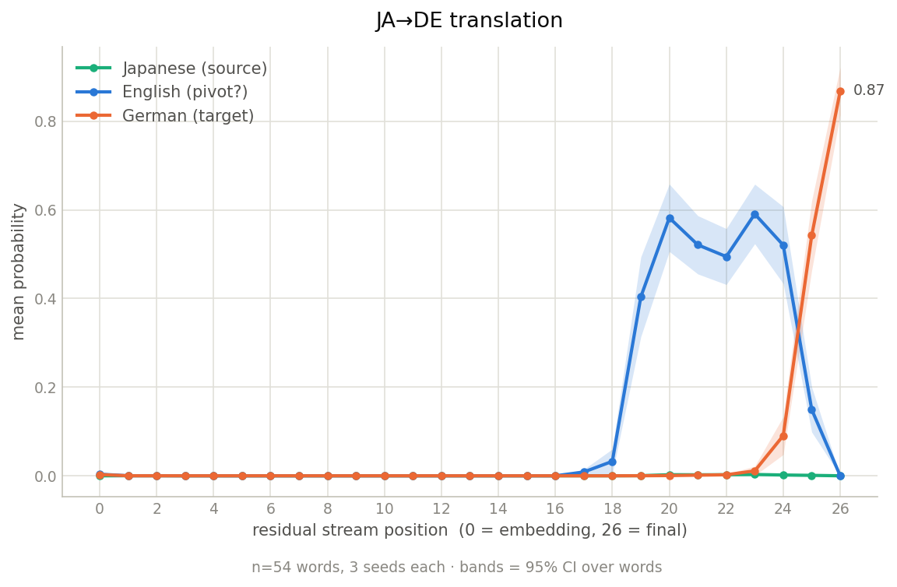
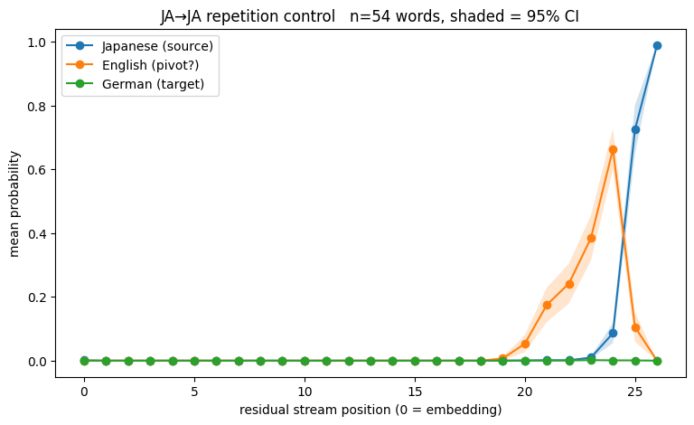

# Does Gemma Work in English?

A logit-lens replication testing whether **gemma-2-2b** routes through English when translating Japanese → German, measured against a Japanese → Japanese repetition control.

## Background and attribution

This replicates the probabilistic half of:

> Wendler, C., Veselovsky, V., Monea, G., & West, R. (2024). *Do Llamas Work in English? On the Latent Language of Multilingual Transformers.* ACL 2024, 15366–15394. [arXiv:2402.10588](https://arxiv.org/abs/2402.10588) · [epfl-dlab/llm-latent-language](https://github.com/epfl-dlab/llm-latent-language)

**Theirs:** the experimental design (few-shot translation and repetition tasks), the logit-lens reading of intermediate residual streams, the word-selection criteria, and the `Start(w)` prefix-summation scoring method (their Appendix A.2).

**Mine:** the port to gemma-2-2b (they use Llama-2 7B/13B/70B and Mistral-7B), the Japanese source language (they cover Chinese, German, French, Russian, Estonian), the German target pairing, and the scoring audit described below.

Wendler's conclusion is narrower than their title: the internal lingua franca is *not English but concepts — concepts biased toward English*. This replication inherits that framing.

## Result

> ⚠️ **These numbers are superseded and are being re-run.** They were produced with
> first-token-only scoring. The `Start(w)` prefix summation described below (Wendler
> Appendix A.2) was specified but never actually implemented in the notebook; it is
> now applied and the sweep has to be repeated. Expect P(English) and P(German) to
> rise in both conditions, and the word count to fall if any triples now collide.
> Retained here so the before/after is on the record.

At n=54 words, **peak P(English) does not separate the two conditions**:

| condition | peak P(EN) | ±95% CI | position |
|---|---|---|---|
| JA→DE translation | 0.6141 | 0.0732 | `23_pre` |
| JA→JA repetition | 0.6626 | 0.0648 | `24_pre` |

Δ (translation − repetition) = **−0.0485**, 95% bootstrap CI over words **[−0.1010, +0.0034]** (2000 resamples).

**This is a replication, not a null result.** Wendler report (§6) that the English-first pattern persists in repetition but is less pronounced, and that for Chinese the source language rises simultaneously with or faster than English — attributing the difference to tokenization. Japanese here is 98% single-token, essentially Chinese's 100% profile and far above their German (43%) or Russian (13%). A weak or absent separation is what their explanation predicts for a high-single-token language; it is not evidence against the English-pivot account.

<p align="center">
  
  
</p>

Both conditions show English rising before the target language resolves. The two English curves differ in *shape* — a broad plateau from layer ~20 under translation versus a narrower late spike under repetition — which the single peak statistic discards. Quantifying that is an open thread (see below).

### Scoring audit

The headline number depends on a detail buried in Wendler's appendix. P(language) is **not** the probability of one token; it is the sum over `Start(w)`, every vocabulary token that could begin the correct word — all token-level prefixes, with and without a leading space, plus byte-fallback tokens. An earlier version of this notebook scored a single first token per language and, for Japanese, scored the *unspaced* form while the prompt guarantees a space-prefixed answer. That made P(Japanese) read near zero at every layer *including the final one*, where Japanese is the correct answer. The asymmetry — German reaching 0.86 while Japanese flatlined — is what exposed it.

Prefix summation is not a cosmetic fix: the final-layer top-5 for 花 is `[' Blume', ' Blumen', ' Bl', ' Pflanze', ' Blüten']`, and `' Bl'` carries real mass that first-token-only scoring throws away.

That correction was itself missed once. The space fix landed; the prefix summation did not, and the n=54 numbers above were produced without it — caught by re-reading the code against the methods notes rather than by any test. The filter cell now asserts that the id sets are wider than one token, so the same omission fails loudly instead of silently.

## Reproduction

**Environment** (versions the reported results were produced on):

| | |
|---|---|
| numpy | 2.0.2 |
| transformers | 4.57.6 |
| transformer_lens | 2.18.0 |
| hardware | Tesla T4 (Kaggle), CUDA |
| dtype | bfloat16 |

See [requirements.txt](requirements.txt). Two installation constraints, both load-bearing:

1. **Install `transformer_lens` with `--no-deps`.** It pins `numpy<2` and will otherwise downgrade numpy underneath an imported binary, causing a C-ABI import error.
2. **Restart the kernel after installing, before importing anything.** Pip replacing packages on disk does not change what is already loaded in memory.

**Running:** open [mechanistic_interpretability.ipynb](mechanistic_interpretability.ipynb) and run top to bottom. It needs a Hugging Face token with access to `google/gemma-2-2b` (prompted for, or set `HF_TOKEN`). Output location defaults to `/kaggle/working` and is overridable via `OUT_DIR`. The sweep is 54 words × 3 seeds × 2 conditions = 324 forward passes; wall-clock is dominated by the ~10 GB model download.

Two sanity gates run before any result is produced, and both should be checked:

- **Behavioural** — the model must actually do the task: 12/12 on translation, 12/12 on repetition.
- **Lens verification** — the hand-rolled lens must reproduce the model's own output distribution. Observed agreement to ~0.6% relative (0.6715 vs 0.6755), max |Δlogit| 0.121 with mean 7.3e-4 and identical top-5 orderings, consistent with bf16 rounding. Note this checks the lens plumbing, *not* the token ids — both sides index the same ids, so a wrong id passes silently. That is exactly how the scoring bug survived.

Gemma-2 applies logit soft-capping (30.0) internally. A hand-rolled lens bypasses that path, so the notebook reapplies it; without this every probability is inflated. bfloat16 is required — fp16 overflows Gemma-2 activations and produces silent NaNs.

## Deviations from Wendler, disclosed

- **No quotes in prompts.** Wendler wrap words in quotes so the answer carries no leading space; these prompts end on a colon, so it does. Internally consistent because scoring covers both spaced and unspaced variants.
- **54 words** vs their 139 (zh) / 104 (de) / 56 (fr) / 115 (ru).
- **Prefix filtering by set disjointness**, not their exact procedure. German noun capitalisation separates DE from EN on case alone (`▁Silber`/`▁silver`), so collision risk here is structurally lower than their French–English pairing. All 54 triples survived the filter.
- **bf16 matmul in the lens** (~8 mantissa bits); agreement with the model is measured, not assumed — see above.
- **No tuned lens**, deliberately. Following Wendler §5: the tuned lens is trained to map intermediate states onto the *final* prediction, which is in the target language, so training it would optimize away the very English signal being measured.

## Limitations and open threads

- The peak statistic collapses each curve to one scalar. The curve *shapes* differ visibly between conditions; a shape-sensitive statistic (mean P(EN) over layers 19–22, or area under the curve) may separate where the peak does not. This would be an exploratory, post-hoc analysis and must be reported as such.
- Single model, single language pair, single prompt template. Concrete single-kanji nouns only — no grammatical items (particles, counters), which is where the current literature actually disagrees.
- The logit lens is blind to any component of a latent orthogonal to token space.

## Repository contents

```
mechanistic_interpretability.ipynb   full experiment, outputs and figures embedded
notebook-audit.md                    cell-by-cell correction log / methods reference
latent-language-lit-review.md        Wendler et al. and follow-up literature
results/fig_*.png                    the two figures at n=54
requirements.txt                     pinned environment
```

The raw `.npy` curve arrays from the n=54 run are not yet committed — the Kaggle session that produced them ended and its container was destroyed before they were pushed. They are regenerated by a clean run of the notebook; the final cell pushes `results/` to GitHub from inside the session to prevent a recurrence.
